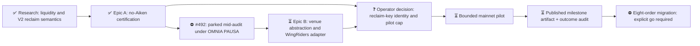

# M1 — WingRiders USDM treasury execution

Updated: 2026-08-07

Legend: ✅ done · 🟡 active/next · ⏳ queued · ⛔ blocked/parked · ❓ unknown

Order only; no schedule is implied.

## Machine-wide pause

**PARKED from 2026-08-07T15:28Z under OMNIA PAUSA, on the operator's order.** No new workers,
research, audits, builds, implementation, transaction work, or unattended compute may start. Release
belongs to the machine owner, crew first and then milestones; silence is not permission.

Ticket #492 stopped at a durable boundary. Signed local candidate `e3104a42` and 23 manifest-bound
observations are banked; the fresh auditor completed full CI successfully, then parked **without an
audit verdict or acceptance**. The four panes remain alive but idle so no context is discarded. No
owned signed-commit test suite is running.

## Current finding

Epic A is accepted: **`NO-AIKEN-CERTIFIED; LIVE OPERATION UNPROVEN PENDING PILOT`**. The deployed
WingRiders V2 contracts can settle a datum-carrying output that the unchanged deployed Amaru treasury
validator can spend. The accepted evidence is signed and preserved on remote branch
`491-wingriders-certification@4a01c343`.

The operator reopened read-only research as ticket #492 because no observed single venue clears the
existing orders' **40,000 USDM** minimum for the full **209,424 ADA** offer. Preliminary instruments
agree that Minswap V2 is the best single venue and is deeper than WingRiders on both sides
(approximately **445,180 vs 359,010 USDM**), contradicting the milestone's original liquidity
premise. They do not yet agree on the fee-correct executable totals: parent calculations, the Danogo
UI, and candidate evidence differ, and no audit verdict exists. Direct-only splits appear near but
not safely above 40,000; only a reported USDCx bridge shows material headroom, with atomicity,
min-receive enforcement, issuer exposure, treasury beneficiary compatibility, and reclaim authority
still unproven.

The candidate also found real batched WingRiders script-beneficiary payouts. That narrows the live
agent question from whether script beneficiaries batch at all to whether the batcher can supply the
datum required by the deployed treasury path. This remains unaccepted pending the parked audit.

WingRiders V2 reclaim still checks exactly one pubkey owner. That owner can reclaim at any time and
may redirect the value. A script/native multisig owner is rejected by the deployed validator.
Therefore this milestone does not claim on-chain equivalence to Sundae's Amaru two-of-four
cancellation policy; it bounds and exposes the operational exception.

## Active stop condition

The certification run ended with independently accepted `CERTIFICATION-PASS`. The operator then
commissioned exactly one read-only continuation: cross-venue executable quotes, explicitly including
Danogo, and the unbatched-script-beneficiary investigation in #492. OMNIA PAUSA now stops even that
read-only continuation until machine-owner release. No implementation, pilot, transaction signing,
submission, cancellation, or value movement is authorized.

A PASS is deliberately narrower than production readiness: it certifies deployed-contract compatibility and the absence of a required Aiken/validator/fork/redeployment change. Live WingRiders agent acceptance remains unproven until a separately authorized bounded pilot.

The eight live Sundae outputs currently contain `209,450.323770 ADA`: `209,424.083770 ADA` is the encoded swap offer and `26.240000 ADA` is eight times the configured `3.28 ADA` per-order overhead.

## Priority

1. On machine-owner release, finish the already-started submission-1 audit without mixing in new live evidence.
2. Reconcile venue-correct fees and executable totals before accepting any 40,000-USDM claim.
3. Investigate Minswap V2 cancel/reclaim authority against deployed bytes before choosing a venue.
4. Decide whether any adapter or pilot remains economically and operationally justified.
5. Only after a separately accepted pilot, request authorization to cancel and migrate the eight pending orders.

## Blockers and unknowns

- ❓ Reclaim owner identity and permitted per-order/aggregate cap require operator approval.
- ❓ Ticket #492 has no accepted result: candidate `e3104a42` is local/unpushed and its auditor is parked before verdict.
- ❓ Minswap V2 cancellation authority, reclaim destination constraint, and expiry semantics are unproven.
- ❓ The only reported route with material price headroom crosses USDCx; its atomicity and recovery model are unproven.
- ✅ The WingRiders compensation datum was proven spendable by the unchanged deployed Amaru treasury validator, with a rejecting diversion control.
- ❓ The live WingRiders off-chain agent may decline an otherwise valid request; only a separately authorized pilot can close this operational gap.
- ❓ Holder-address APIs did not enumerate venues reliably: the observed Blockfrost endpoint is not quantity-ordered, and the Koios result cap covered only about 16% of USDM supply with no visible pool script. Ticket #492 must use venue-specific or aggregator executable-quote instruments rather than infer absence from those incomplete lists.
- ⛔ Mainnet submission and migration remain blocked until the released artifact passes the live-boundary pilot and the operator says go.
- ⛔ Any design requiring a WingRiders smart-contract change is permanently out of scope.
- ⛔ The immutable evidence branch is CI-red at format-check and must not be merged as-is; reformatting its four manifest-bound harness files would invalidate the accepted snapshot.
