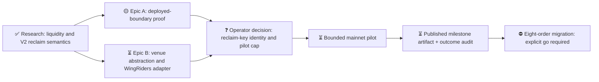

# M1 — WingRiders USDM treasury execution

Updated: 2026-08-07

Legend: ✅ done · 🟡 active/next · ⏳ queued · ⛔ blocked · ❓ unknown

Order only; no schedule is implied.

## Current finding

USDM liquidity is concentrated on WingRiders, but WingRiders V2 reclaim checks exactly one pubkey owner. That owner can reclaim at any time and may redirect the value. A script/native multisig owner is rejected by the deployed validator. Therefore this milestone does not claim on-chain equivalence to Sundae's Amaru two-of-four cancellation policy; it bounds and exposes the operational exception.

## Priority

1. Prove the exact deployed contract boundary and treasury settlement datum.
2. Generalize the existing swap builder behind a venue-tagged intent while preserving Sundae behavior.
3. Add quote binding, exposure/deadline gates, inspection, and reclaim.
4. Release the milestone artifact and run an operator-authorized bounded pilot.
5. Only after pilot acceptance, request separate authorization to cancel and migrate the eight pending orders.

## Blockers and unknowns

- ❓ Reclaim owner identity and permitted per-order/aggregate cap require operator approval.
- ❓ WingRiders compensation datum must be proven spendable by the Amaru treasury validator with a negative control.
- ⛔ Mainnet submission and migration remain blocked until the released artifact passes the live-boundary pilot and the operator says go.
- ⛔ Any design requiring a WingRiders smart-contract change is permanently out of scope.
