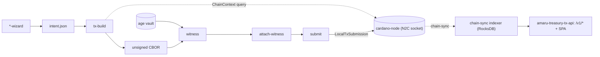

# amaru-treasury-tx

Build unsigned Amaru treasury transactions (disburse, reorganize,
withdraw, swap) from unified intents, then witness, assemble, and
submit them.

## What is this

`amaru-treasury-tx` is a Haskell CLI for operating the Amaru treasury
on Cardano. Typed wizards verify the upstream
[`pragma-org/amaru-treasury/journal/2026/`][recipes] `metadata.json`
against the on-chain registry NFT and build-time-pinned Plutus blobs,
then emit a unified `intent.json`. `tx-build` turns an intent into the
unsigned Conway CBOR the operator signs, re-evaluating every redeemer
against a live `ChainContext` before any bytes are written. It is a
Haskell port of the bash recipes in that upstream journal, built on the
[`cardano-node-clients` `TxBuild` DSL][txbuild].

Signing stays off the build path. The same binary creates detached,
age-encrypted vault-backed witnesses (`vault` / `witness`), merges them
into the unsigned transaction (`attach-witness`), and submits the result
through a local node socket (`submit`). Transactions are scoped to the
registered treasury scopes — `core_development`, `ops_and_use_cases`,
`network_compliance`, `middleware`, and `contingency`.

A hosted operator web app runs at
**<https://amaru-treasury.plutimus.com>** — a browser SPA backed by the
`amaru-treasury-tx-api` server with an embedded chain-sync indexer:
**View** (live dashboard across the registered scopes), **Audit**
(indexer-backed history and tx detail with RDF-resolved scope/role
labels and named SPARQL / SHACL lenses), **Operate** (build unsigned
swap / disburse / reorganize transactions from the browser, with a Graph
tab previewing the resolved spend→produce effect), and **Books** (saved
operator values). The app builds unsigned transactions only; signing and
submission stay off the server.

## Architecture



`tx-build` reads the action discriminator and the network from the
intent itself (single source of truth) and dispatches to the matching
builder. See the [architecture overview][arch] for the full module map.

## Install

**macOS (Apple Silicon)**:

```bash
brew tap lambdasistemi/tap
brew install amaru-treasury-tx
```

**Linux (x86_64)** — AppImage / `.deb` / `.rpm` from the
[releases page](https://github.com/lambdasistemi/amaru-treasury-tx/releases/latest):

```bash
curl -L \
  https://github.com/lambdasistemi/amaru-treasury-tx/releases/latest/download/amaru-treasury-tx.AppImage \
  -o amaru-treasury-tx
chmod +x ./amaru-treasury-tx
./amaru-treasury-tx --help
```

Or run from the flake without installing:

```bash
nix run github:lambdasistemi/amaru-treasury-tx -- --help
```

## Quickstart

```bash
# 1. Point at a mainnet node.
export CARDANO_NODE_SOCKET_PATH=/path/to/cardano-node.socket

# 2. Fetch the upstream metadata. The wizard treats this as an
#    untrusted hint and re-verifies every consumed field on-chain.
curl -fsSL https://raw.githubusercontent.com/pragma-org/amaru-treasury/main/journal/2026/metadata.json \
    -o metadata-mainnet.json

# 3. Resolve a disbursement into a unified intent, then build the
#    unsigned tx (--unit defaults to USDM; 100000000 = 100 USDM).
amaru-treasury-tx disburse-wizard \
    --wallet-addr addr1... \
    --metadata metadata-mainnet.json \
    --scope network_compliance \
    --amount 100000000 \
    --beneficiary-addr addr1... \
    --description "…" --justification "…" --destination-label "…" \
    --out disburse.intent.json
amaru-treasury-tx tx-build \
    --intent disburse.intent.json \
    --out tx.cbor.hex \
    --report report.json

# 4. Witness from an age vault, assemble, and submit.
amaru-treasury-tx witness --tx tx.cbor.hex --vault vault.age \
    --identity <label> --out witness.hex
amaru-treasury-tx attach-witness --tx tx.cbor.hex \
    --witness "$(cat witness.hex)" --out signed.hex
amaru-treasury-tx submit --tx signed.hex
```

The full walkthrough — wizard-to-`tx-build` pipes, the pre-signing
report review, and creating the vault — is on the
[Quickstart page][quickstart].

## Usage

| Command | Purpose |
| :------ | :------ |
| `swap-wizard` / `swap-quote` | Resolve a SundaeSwap ADA↔USDM swap into a unified `intent.json` (quote-derived variant via `swap-quote`). |
| `disburse-wizard` | Resolve an ADA or USDM disbursement (USDM is the default unit). `--scope contingency --to <scope>:<ada>` does a multi-scope contingency ADA disburse. |
| `withdraw-wizard` | Resolve a treasury reward withdrawal, or exit cleanly when rewards are zero. |
| `reorganize-wizard` | Consolidate or split treasury UTxOs, with automatic batching when one transaction cannot hold the whole scope. |
| `swap-cancel` | Build unsigned CBOR that cancels one pending SundaeSwap V3 order back to the treasury. |
| `swap-rerate` | Re-rate selected pending SundaeSwap orders with a wallet address, preferring one atomic cancel-and-reoffer transaction and reporting a split fallback when over budget. |
| `tx-build` | Turn a unified `intent.json` into unsigned Conway CBOR; re-evaluate every redeemer against a live `ChainContext`; optionally write a deterministic report with `--report`. |
| `report-render` | Render a `tx-build` build-output envelope as reviewable Markdown. |
| `vault` / `witness` / `attach-witness` / `submit` | Create an age vault, produce a detached vkey witness, merge witnesses, submit signed CBOR via the node socket. |
| `envelope-tx` / `envelope-witness` / `envelope-signed-tx` / `de-envelope` | Convert raw CBOR hex to/from `cardano-cli` Conway envelopes. |
| `treasury-inspect` | Read-only report: treasury balances + pending SundaeSwap orders per scope. |
| `history` / `tx-detail` | Read-only treasury history / one decoded transaction from the local chain-sync indexer. |
| `serve` | Run the HTTP API service (same server as the `amaru-treasury-tx-api` executable). |
| `registry-init-wizard` / `stake-reward-init-wizard` / `governance-withdrawal-init-wizard` | DevNet-only bootstrap intents — see [DevNet bootstrap][devnet]. |

Run `amaru-treasury-tx <command> --help` for the exact flags, or see the
per-command recipe pages in the [documentation][docs].

## Documentation

The full operator and developer documentation lives at
**<https://lambdasistemi.github.io/amaru-treasury-tx/>**:

- [Quickstart][quickstart] — wizard-to-`tx-build` pipelines end to end.
- [Architecture][arch] and [Trust model][trust] — module layout, data
  flow, and what the wizard verifies vs. what the operator must assert.
- [Swap][swap] · [Swap re-rate][swap-rerate] ·
  [Disburse][disburse] · [Withdraw][withdraw] ·
  [Reorganize][reorganize] · [Inspect][inspect] — per-action recipes.
- [DevNet bootstrap][devnet] — the registry / stake-reward / governance
  bootstrap flow through the shipped CLI.
- [Parity report][parity] — byte-for-byte golden parity for the swap
  fixture.

**For AI agents, start at [AGENTS.md](AGENTS.md).** This repo ships a
vendor-neutral [Agent Skill](https://agentskills.io/home) under
[`skills/`](skills/) that walks any compatible coding agent (Claude
Code, OpenAI Codex, Cursor, Gemini CLI, …) through the full operator
pipeline, with a one-time first-run interview that caches operator paths
and identities to `~/.config/amaru-treasury-tx/operator.json`.

## Development

```bash
nix develop
just ci      # build + schema-check + unit + golden + format-check + hlint + smoke + release-check
```

Smoke the release-facing signer path locally:

```bash
nix develop --quiet -c just smoke
```

Run the opt-in local devnet node smoke, or the full shipped-CLI DevNet
proof:

```bash
nix develop --quiet -c just devnet-smoke node
nix develop --quiet -c just devnet-cli-smoke --phase full --timeout-seconds 900
```

The library-level DevNet proof phases
(`just devnet-smoke {registry-init,stake-reward-init,
governance-withdrawal-init,disburse-submit,swap-ready}`) and the
captured live-DevNet evidence are documented under
[DevNet bootstrap][devnet] and [Local devnet smoke][smoke].

## License

Apache-2.0 — see [LICENSE](LICENSE).

[recipes]: https://github.com/pragma-org/amaru-treasury/tree/main/journal/2026
[txbuild]: https://github.com/lambdasistemi/cardano-node-clients/blob/main/lib/Cardano/Node/Client/TxBuild.hs
[docs]: https://lambdasistemi.github.io/amaru-treasury-tx/
[quickstart]: https://lambdasistemi.github.io/amaru-treasury-tx/quickstart/
[arch]: https://lambdasistemi.github.io/amaru-treasury-tx/architecture/
[trust]: https://lambdasistemi.github.io/amaru-treasury-tx/trust-model/
[swap]: https://lambdasistemi.github.io/amaru-treasury-tx/swap/
[swap-rerate]: https://lambdasistemi.github.io/amaru-treasury-tx/swap-rerate/
[disburse]: https://lambdasistemi.github.io/amaru-treasury-tx/disburse/
[withdraw]: https://lambdasistemi.github.io/amaru-treasury-tx/withdraw/
[reorganize]: https://lambdasistemi.github.io/amaru-treasury-tx/reorganize/
[inspect]: https://lambdasistemi.github.io/amaru-treasury-tx/inspect/
[devnet]: https://lambdasistemi.github.io/amaru-treasury-tx/devnet-bootstrap/
[parity]: https://lambdasistemi.github.io/amaru-treasury-tx/parity/
[smoke]: https://lambdasistemi.github.io/amaru-treasury-tx/local-devnet-smoke/
