# amaru-treasury-tx dependency graph

Computed from the Nix flake closure + `cabal.project` `source-repository-package` entries at locked revisions. Every edge is pinned to an exact commit hash.

## Repositories

| Repo | Owner | Description |
|------|-------|-------------|
| [**amaru-treasury-tx**](https://github.com/lambdasistemi/amaru-treasury-tx/tree/main) | lambdasistemi | Build Amaru treasury transactions (disburse, reorganize, withdraw) |
| [**cardano-ledger-read**](https://github.com/cardano-foundation/cardano-ledger-read/tree/34d0767bd5c3) | cardano-foundation | Read Cardano block data, parametrized by era |
| [**browser-json-tree**](https://github.com/lambdasistemi/browser-json-tree/tree/970657fd5152) | lambdasistemi | Typed Halogen renderer + click behaviour for collapsible JSON trees |
| [**cardano-ledger-rdf**](https://github.com/lambdasistemi/cardano-ledger-rdf/tree/27b68fc0f8ed) | lambdasistemi | Cardano transaction graph and RDF tools |
| [**cardano-node-clients**](https://github.com/lambdasistemi/cardano-node-clients/tree/bebf9b22fd3a) | lambdasistemi | Haskell clients for Cardano node mini-protocols (N2C + N2N) |
| [**cardano-tx-tools**](https://github.com/lambdasistemi/cardano-tx-tools/tree/2bd36e28ce3f) | lambdasistemi | Cardano transaction tooling: builder, structural diff, blueprint decoding. Uses cardano-node-clients but is not a node client. |
| [**chain-follower**](https://github.com/lambdasistemi/chain-follower/tree/d592a5015f8d) | lambdasistemi | Abstract chain follower types — Follower, Intersector, ProgressOrRewind |
| [**github-release-check**](https://github.com/lambdasistemi/github-release-check/tree/d90131112a4d) | lambdasistemi | Haskell library: check GitHub Releases API for newer versions of a CLI and print an update banner. Cache-aware, opt-out via env var, silent on failure. |
| [**rocksdb-haskell**](https://github.com/lambdasistemi/rocksdb-haskell/tree/a3e86b39f951) | lambdasistemi | RocksDB Haskell Bindings |
| [**rocksdb-kv-transactions**](https://github.com/lambdasistemi/rocksdb-kv-transactions/tree/e2e77579888e) | lambdasistemi | RocksDB backend for key-value transactions |
| [**dev-assets**](https://github.com/paolino/dev-assets/tree/b9718cb996f6) | paolino | Actions for haskell, nix and mkdocs workflows |
| [**purescript-overlay**](https://github.com/paolino/purescript-overlay/tree/e1f4cc532a84) | paolino | PureScript core tools in Nix |
| [**amaru-treasury**](https://github.com/pragma-org/amaru-treasury/tree/fb1937964196) | pragma-org | A smart contract for managing Amaru's treasury  |

## Flake inputs

### amaru-treasury-tx (root)

| Input | Target | Type | Source |
|-------|--------|------|--------|
| `browser-json-tree` | lambdasistemi/browser-json-tree `970657fd5152` | flake | [flake.nix](https://github.com/lambdasistemi/amaru-treasury-tx/blob/main/flake.nix) |
| `dev-assets` | paolino/dev-assets `b9718cb996f6` | flake | [flake.nix](https://github.com/lambdasistemi/amaru-treasury-tx/blob/main/flake.nix) |
| `purescript-overlay` | paolino/purescript-overlay `e1f4cc532a84` | flake | [flake.nix](https://github.com/lambdasistemi/amaru-treasury-tx/blob/main/flake.nix) |
| `amaru-treasury` | pragma-org/amaru-treasury `fb1937964196` | flake | [flake.nix](https://github.com/lambdasistemi/amaru-treasury-tx/blob/main/flake.nix) |

## Cabal source-repository-package

### lambdasistemi/amaru-treasury-tx @ `main`

| Dependency | Locked tag | Source |
|------------|-----------|--------|
| cardano-foundation/cardano-ledger-read | `34d0767bd5c3` | [cabal.project:74](https://github.com/lambdasistemi/amaru-treasury-tx/blob/main/cabal.project#L74) |
| lambdasistemi/cardano-ledger-rdf | `27b68fc0f8ed` | [cabal.project:36](https://github.com/lambdasistemi/amaru-treasury-tx/blob/main/cabal.project#L36) |
| lambdasistemi/cardano-node-clients | `bebf9b22fd3a` | [cabal.project:46](https://github.com/lambdasistemi/amaru-treasury-tx/blob/main/cabal.project#L46) |
| lambdasistemi/cardano-tx-tools | `2bd36e28ce3f` | [cabal.project:25](https://github.com/lambdasistemi/amaru-treasury-tx/blob/main/cabal.project#L25) |
| lambdasistemi/chain-follower | `d592a5015f8d` | [cabal.project:56](https://github.com/lambdasistemi/amaru-treasury-tx/blob/main/cabal.project#L56) |
| lambdasistemi/github-release-check | `d90131112a4d` | [cabal.project:101](https://github.com/lambdasistemi/amaru-treasury-tx/blob/main/cabal.project#L101) |
| lambdasistemi/rocksdb-haskell | `a3e86b39f951` | [cabal.project:68](https://github.com/lambdasistemi/amaru-treasury-tx/blob/main/cabal.project#L68) |
| lambdasistemi/rocksdb-kv-transactions | `e2e77579888e` | [cabal.project:62](https://github.com/lambdasistemi/amaru-treasury-tx/blob/main/cabal.project#L62) |

### lambdasistemi/cardano-node-clients @ `bebf9b22fd3a`

| Dependency | Locked tag | Source |
|------------|-----------|--------|
| cardano-foundation/cardano-ledger-read | `34d0767bd5c3` | [cabal.project:41](https://github.com/lambdasistemi/cardano-node-clients/blob/bebf9b22fd3a/cabal.project#L41) |
| lambdasistemi/chain-follower | `d592a5015f8d` | [cabal.project:23](https://github.com/lambdasistemi/cardano-node-clients/blob/bebf9b22fd3a/cabal.project#L23) |
| lambdasistemi/rocksdb-haskell | `a3e86b39f951` | [cabal.project:35](https://github.com/lambdasistemi/cardano-node-clients/blob/bebf9b22fd3a/cabal.project#L35) |
| lambdasistemi/rocksdb-kv-transactions | `e2e77579888e` | [cabal.project:29](https://github.com/lambdasistemi/cardano-node-clients/blob/bebf9b22fd3a/cabal.project#L29) |

### lambdasistemi/cardano-node-clients @ `ca86f11d27b3`

| Dependency | Locked tag | Source |
|------------|-----------|--------|
| cardano-foundation/cardano-ledger-read | `34d0767bd5c3` | [cabal.project:41](https://github.com/lambdasistemi/cardano-node-clients/blob/ca86f11d27b3/cabal.project#L41) |
| lambdasistemi/chain-follower | `371b5930976a` | [cabal.project:23](https://github.com/lambdasistemi/cardano-node-clients/blob/ca86f11d27b3/cabal.project#L23) |
| lambdasistemi/rocksdb-haskell | `a3e86b39f951` | [cabal.project:35](https://github.com/lambdasistemi/cardano-node-clients/blob/ca86f11d27b3/cabal.project#L35) |
| lambdasistemi/rocksdb-kv-transactions | `e2e77579888e` | [cabal.project:29](https://github.com/lambdasistemi/cardano-node-clients/blob/ca86f11d27b3/cabal.project#L29) |

### lambdasistemi/cardano-tx-tools @ `2bd36e28ce3f`

| Dependency | Locked tag | Source |
|------------|-----------|--------|
| cardano-foundation/cardano-ledger-read | `34d0767bd5c3` | [cabal.project:69](https://github.com/lambdasistemi/cardano-tx-tools/blob/2bd36e28ce3f/cabal.project#L69) |
| lambdasistemi/cardano-node-clients | `ca86f11d27b3` | [cabal.project:30](https://github.com/lambdasistemi/cardano-tx-tools/blob/2bd36e28ce3f/cabal.project#L30) |
| lambdasistemi/chain-follower | `371b5930976a` | [cabal.project:51](https://github.com/lambdasistemi/cardano-tx-tools/blob/2bd36e28ce3f/cabal.project#L51) |
| lambdasistemi/github-release-check | `d90131112a4d` | [cabal.project:41](https://github.com/lambdasistemi/cardano-tx-tools/blob/2bd36e28ce3f/cabal.project#L41) |
| lambdasistemi/rocksdb-haskell | `a3e86b39f951` | [cabal.project:63](https://github.com/lambdasistemi/cardano-tx-tools/blob/2bd36e28ce3f/cabal.project#L63) |
| lambdasistemi/rocksdb-kv-transactions | `e2e77579888e` | [cabal.project:57](https://github.com/lambdasistemi/cardano-tx-tools/blob/2bd36e28ce3f/cabal.project#L57) |

### lambdasistemi/chain-follower @ `371b5930976a`

| Dependency | Locked tag | Source |
|------------|-----------|--------|
| lambdasistemi/rocksdb-haskell | `a3e86b39f951` | [cabal.project:17](https://github.com/lambdasistemi/chain-follower/blob/371b5930976a/cabal.project#L17) |
| lambdasistemi/rocksdb-kv-transactions | `e2e77579888e` | [cabal.project:11](https://github.com/lambdasistemi/chain-follower/blob/371b5930976a/cabal.project#L11) |

### lambdasistemi/chain-follower @ `d592a5015f8d`

| Dependency | Locked tag | Source |
|------------|-----------|--------|
| lambdasistemi/rocksdb-haskell | `a3e86b39f951` | [cabal.project:17](https://github.com/lambdasistemi/chain-follower/blob/d592a5015f8d/cabal.project#L17) |
| lambdasistemi/rocksdb-kv-transactions | `e2e77579888e` | [cabal.project:11](https://github.com/lambdasistemi/chain-follower/blob/d592a5015f8d/cabal.project#L11) |

### lambdasistemi/rocksdb-kv-transactions @ `e2e77579888e`

| Dependency | Locked tag | Source |
|------------|-----------|--------|
| lambdasistemi/rocksdb-haskell | `a3e86b39f951` | [cabal.project:5](https://github.com/lambdasistemi/rocksdb-kv-transactions/blob/e2e77579888e/cabal.project#L5) |

## ⚠️ Pin skew

The same dependency is pinned to different revisions by different declarers. Because `source-repository-package` entries are flattened at the root, **the root's pin wins** — any dependency declaring a different rev is silently built against the root's.

### lambdasistemi/cardano-node-clients

Effective (root pin): [`bebf9b22fd3a`](https://github.com/lambdasistemi/cardano-node-clients/commit/bebf9b22fd3a)

| Declared by | at its own rev | Pins this dep to |
|-------------|----------------|------------------|
| lambdasistemi/amaru-treasury-tx | `main` | [`bebf9b22fd3a`](https://github.com/lambdasistemi/cardano-node-clients/commit/bebf9b22fd3a137e406020e09b98849ea69231f3) |
| lambdasistemi/cardano-tx-tools | `2bd36e28ce3f` | [`ca86f11d27b3`](https://github.com/lambdasistemi/cardano-node-clients/commit/ca86f11d27b34e37d3814e4d3c3d66e256400403) |

### lambdasistemi/chain-follower

Effective (root pin): [`d592a5015f8d`](https://github.com/lambdasistemi/chain-follower/commit/d592a5015f8d)

| Declared by | at its own rev | Pins this dep to |
|-------------|----------------|------------------|
| lambdasistemi/amaru-treasury-tx | `main` | [`d592a5015f8d`](https://github.com/lambdasistemi/chain-follower/commit/d592a5015f8d7edb2d6022936a67a054dfe5329f) |
| lambdasistemi/cardano-node-clients | `bebf9b22fd3a` | [`d592a5015f8d`](https://github.com/lambdasistemi/chain-follower/commit/d592a5015f8d7edb2d6022936a67a054dfe5329f) |
| lambdasistemi/cardano-node-clients | `ca86f11d27b3` | [`371b5930976a`](https://github.com/lambdasistemi/chain-follower/commit/371b5930976ac3bb4e8a4ef576d5098d706984ee) |
| lambdasistemi/cardano-tx-tools | `2bd36e28ce3f` | [`371b5930976a`](https://github.com/lambdasistemi/chain-follower/commit/371b5930976ac3bb4e8a4ef576d5098d706984ee) |

## Diagram

```mermaid
graph TD
    classDef haskell fill:#5e5086,stroke:#3d3364,color:#fff
    classDef aiken fill:#e06c3c,stroke:#b34a24,color:#fff
    classDef purescript fill:#1d222d,stroke:#14181f,color:#fff
    classDef nix fill:#7ebae4,stroke:#5a8ab0,color:#000

    amaru_treasury_tx["<a href='https://github.com/lambdasistemi/amaru-treasury-tx/tree/main'>amaru-treasury-tx</a><br/>Build Amaru treasury transactions<br/>(disburse, reorganize, withdraw)<br/><a href='https://github.com/lambdasistemi/amaru-treasury-tx/commit/main'><code>main</code></a>"]:::haskell
    cardano_ledger_read["<a href='https://github.com/cardano-foundation/cardano-ledger-read/tree/34d0767bd5c3'>cardano-ledger-read</a><br/>Read Cardano block data, parametrized by<br/>era<br/><a href='https://github.com/cardano-foundation/cardano-ledger-read/commit/34d0767bd5c3'><code>34d0767bd5c3</code></a>"]:::haskell
    browser_json_tree["<a href='https://github.com/lambdasistemi/browser-json-tree/tree/970657fd5152'>browser-json-tree</a><br/>Typed Halogen renderer + click behaviour<br/>for collapsible JSON trees<br/><a href='https://github.com/lambdasistemi/browser-json-tree/commit/970657fd5152'><code>970657fd5152</code></a>"]:::haskell
    cardano_ledger_rdf["<a href='https://github.com/lambdasistemi/cardano-ledger-rdf/tree/27b68fc0f8ed'>cardano-ledger-rdf</a><br/>Cardano transaction graph and RDF tools<br/><a href='https://github.com/lambdasistemi/cardano-ledger-rdf/commit/27b68fc0f8ed'><code>27b68fc0f8ed</code></a>"]:::haskell
    cardano_node_clients["<a href='https://github.com/lambdasistemi/cardano-node-clients/tree/bebf9b22fd3a'>cardano-node-clients</a><br/>Haskell clients for Cardano node<br/>mini-protocols (N2C + N2N)<br/><a href='https://github.com/lambdasistemi/cardano-node-clients/commit/bebf9b22fd3a'><code>bebf9b22fd3a</code></a>"]:::haskell
    cardano_tx_tools["<a href='https://github.com/lambdasistemi/cardano-tx-tools/tree/2bd36e28ce3f'>cardano-tx-tools</a><br/>Cardano transaction tooling: builder,<br/>structural diff, blueprint decoding.<br/>Uses cardano-node-clients but is not a<br/>node client.<br/><a href='https://github.com/lambdasistemi/cardano-tx-tools/commit/2bd36e28ce3f'><code>2bd36e28ce3f</code></a>"]:::haskell
    chain_follower["<a href='https://github.com/lambdasistemi/chain-follower/tree/d592a5015f8d'>chain-follower</a><br/>Abstract chain follower types —<br/>Follower, Intersector, ProgressOrRewind<br/><a href='https://github.com/lambdasistemi/chain-follower/commit/d592a5015f8d'><code>d592a5015f8d</code></a>"]:::haskell
    github_release_check["<a href='https://github.com/lambdasistemi/github-release-check/tree/d90131112a4d'>github-release-check</a><br/>Haskell library: check GitHub Releases<br/>API for newer versions of a CLI and<br/>print an update banner. Cache-aware,<br/>opt-out via env var, silent on failure.<br/><a href='https://github.com/lambdasistemi/github-release-check/commit/d90131112a4d'><code>d90131112a4d</code></a>"]:::haskell
    rocksdb_haskell["<a href='https://github.com/lambdasistemi/rocksdb-haskell/tree/a3e86b39f951'>rocksdb-haskell</a><br/>RocksDB Haskell Bindings<br/><a href='https://github.com/lambdasistemi/rocksdb-haskell/commit/a3e86b39f951'><code>a3e86b39f951</code></a>"]:::haskell
    rocksdb_kv_transactions["<a href='https://github.com/lambdasistemi/rocksdb-kv-transactions/tree/e2e77579888e'>rocksdb-kv-transactions</a><br/>RocksDB backend for key-value<br/>transactions<br/><a href='https://github.com/lambdasistemi/rocksdb-kv-transactions/commit/e2e77579888e'><code>e2e77579888e</code></a>"]:::haskell
    dev_assets["<a href='https://github.com/paolino/dev-assets/tree/b9718cb996f6'>dev-assets</a><br/>Actions for haskell, nix and mkdocs<br/>workflows<br/><a href='https://github.com/paolino/dev-assets/commit/b9718cb996f6'><code>b9718cb996f6</code></a>"]:::nix
    purescript_overlay["<a href='https://github.com/paolino/purescript-overlay/tree/e1f4cc532a84'>purescript-overlay</a><br/>PureScript core tools in Nix<br/><a href='https://github.com/paolino/purescript-overlay/commit/e1f4cc532a84'><code>e1f4cc532a84</code></a>"]:::haskell
    amaru_treasury["<a href='https://github.com/pragma-org/amaru-treasury/tree/fb1937964196'>amaru-treasury</a><br/>A smart contract for managing Amaru's<br/>treasury<br/><a href='https://github.com/pragma-org/amaru-treasury/commit/fb1937964196'><code>fb1937964196</code></a>"]:::aiken

    amaru_treasury_tx -->|"browser-json-tree"| browser_json_tree
    amaru_treasury_tx -->|"dev-assets"| dev_assets
    amaru_treasury_tx -->|"purescript-overlay"| purescript_overlay
    amaru_treasury_tx -->|"amaru-treasury"| amaru_treasury
    amaru_treasury_tx ==> cardano_ledger_read
    amaru_treasury_tx ==> cardano_ledger_rdf
    amaru_treasury_tx ==> cardano_node_clients
    amaru_treasury_tx ==> cardano_tx_tools
    amaru_treasury_tx ==> chain_follower
    amaru_treasury_tx ==> github_release_check
    amaru_treasury_tx ==> rocksdb_haskell
    amaru_treasury_tx ==> rocksdb_kv_transactions
    cardano_node_clients ==> cardano_ledger_read
    cardano_node_clients ==> chain_follower
    cardano_node_clients ==> rocksdb_haskell
    cardano_node_clients ==> rocksdb_kv_transactions
    cardano_tx_tools ==> cardano_ledger_read
    cardano_tx_tools ==> cardano_node_clients
    cardano_tx_tools ==> chain_follower
    cardano_tx_tools ==> github_release_check
    cardano_tx_tools ==> rocksdb_haskell
    cardano_tx_tools ==> rocksdb_kv_transactions
    chain_follower ==> rocksdb_haskell
    chain_follower ==> rocksdb_kv_transactions
    rocksdb_kv_transactions ==> rocksdb_haskell
    cardano_tx_tools -.->|"skew ca86f11d27b3"| cardano_node_clients
    cardano_node_clients -.->|"skew 371b5930976a"| chain_follower
    cardano_tx_tools -.->|"skew 371b5930976a"| chain_follower

    linkStyle 0,1,2,3 stroke:#2196F3,stroke-width:2px
    linkStyle 4,5,6,7,8,9,10,11,12,13,14,15,16,17,18,19,20,21,22,23,24 stroke:#e53935,stroke-width:2px
    linkStyle 25,26,27 stroke:#ffb300,stroke-width:1px,stroke-dasharray:4 3
```

**Legend**

| | |
|---|---|
| **Nodes** | |
|  Purple | Haskell |
|  Orange | Aiken |
|  Dark | PureScript |
|  Blue | Nix |
| **Edges** | |
|  Blue solid ──> | Flake input (declared in `flake.nix`) |
|  Light blue dashed --.-> | Flake follows (delegated to another input) |
|  Red thick ==> | Cabal `source-repository-package` |
|  Amber dashed --.-> | Pin skew: declarer pins a different rev than the effective (root) pin |
