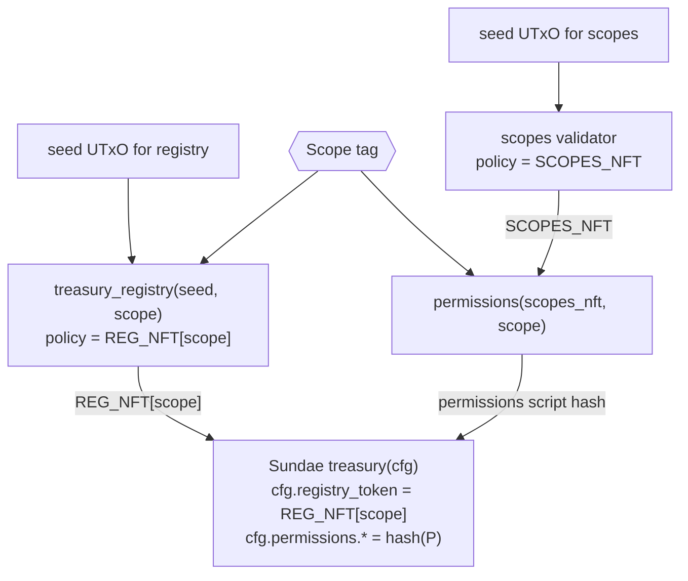
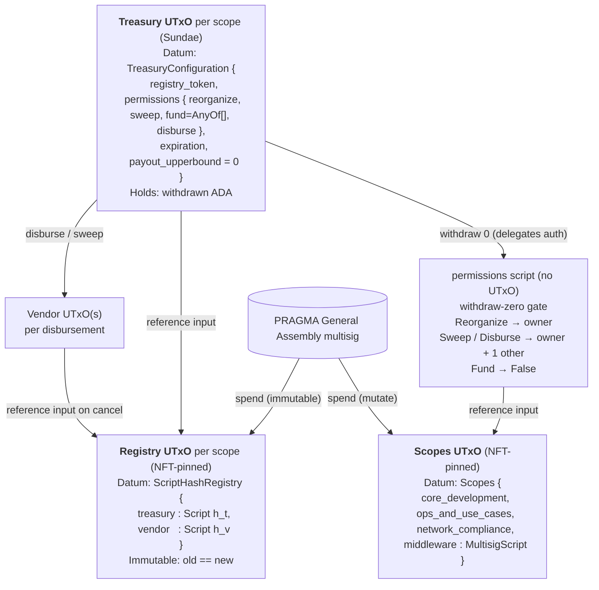

# Trust model

This page is the canonical reference for what `amaru-treasury-tx`
trusts when it produces an unsigned transaction. It synthesises the
upstream Amaru treasury system into a dependency graph and names the
trust roots and threat surfaces this CLI cannot eliminate.

The CLI's safety story has two layers:

1. **The on-chain registry walk verifier** (under
   `Amaru.Treasury.Registry.Verify`) reduces an untrusted
   `metadata.json` hint to a `VerifiedRegistry` projection,
   refusing every claim that disagrees with chain or build-time
   derivation.
2. **The swap wizard** (under `Amaru.Treasury.Tx.SwapWizard`)
   composes verified registry data with operator-supplied wizard
   answers and a curated `NetworkConstants` table to produce
   `intent.json`.

The verifier's trust roots are described below; the wizard adds two
more layers that are explicitly NOT verified by this codebase.

## System overview

The upstream treasury (
[`pragma-org/amaru-treasury`](https://github.com/pragma-org/amaru-treasury))
has **three NFT-pinned UTxO families** — Scopes, Registry, Treasury —
plus a permissions script that holds no UTxO and is invoked through
the withdraw-zero pattern.

> The treasury holds the money but knows nothing about owners; it
> asks permissions; permissions asks the scopes UTxO; the registry
> tells everyone where the treasury and vendor scripts live — all
> three lookups are by NFT policy id, so addresses can rotate
> without re-parameterising scripts.

### Bake-time parameter graph

Each script's hash is fixed at deploy time by:

- the **seed UTxO** that anchors the NFT policy (one-shot — once
  the seed is spent, the policy id can never be re-minted);
- the **scope tag** parameter for per-scope variants
  (permissions, registry, treasury);
- the **scopes NFT policy** which permissions reads as a reference
  input to discover owner credentials.

### Run-time UTxO graph

### Why each arrow exists

| Arrow | Direction | Reason |
|---|---|---|
| Treasury → Permissions | runtime, withdraw-zero | Sundae's treasury delegates *who can sweep / disburse / reorganize* to the permissions script. `TreasuryConfiguration.permissions.*` literally stores the permissions script hash. |
| Permissions → Scopes | runtime, **reference input** | `expect_scopes(self.reference_inputs, scopes_nft)` — owner credentials are *dynamic*, so permissions reads them from the Scopes UTxO each time. Decouples ownership rotation from script hashes. |
| Treasury → Registry | runtime, **reference input** | Sundae's vendor logic needs the treasury & vendor script hashes (e.g. for cancel-to-treasury). It locates them via the `registry_token` policy baked into `TreasuryConfiguration`. |
| Scopes UTxO ← admin | spend | Mutable but only by PRAGMA General Assembly multisig (`must_be_approved_by_general_assembly`). New datum must still match the `Scopes` shape. |
| Registry UTxO ← admin | spend | Spendable only by GA, and `with_state` forces `old_datum == new_datum` — effectively immutable until the NFT is burned. |
| Both NFT mints ← seed UTxO | one-shot | The two trap validators are parameterised by a seed `OutputReference` so the policy id is unique and minting can only happen once. |
| Vendor → Registry | runtime, reference input | Vendor outputs use the registry to find the treasury hash to return to on cancel. |

## Verifier trust roots (layer 1)

Two and only two:

1. **Build-time pinned constants** in
   `Amaru.Treasury.Registry.Constants`:
   - the two seed `OutputReference`s
     (`scopesSeedTxIdHex`, `registrySeedTxIdHex`),
   - the four compiled Plutus blobs (`scopes`,
     `treasury_registry`, `permissions`, `treasury`) embedded
     from `assets/plutus/*.cbor`.
   These are reviewed in the PR that advances the upstream pin.
   The seeds are load-bearing: they make every NFT policy
   one-shot, so a forged Scopes or Registry NFT under our
   policy id is impossible.
2. **The on-chain ledger** observed through a local
   `cardano-node` socket. The verifier never trusts a remote
   indexer, an HTTP endpoint, or the operator's filesystem
   outside of the metadata hint.

`metadata.json` is **not** a trust root. Every consumed field is
cross-checked against an anchor (chain or build-time derivation),
and an unverifiable field aborts the run.

### What the verifier protects against

- **Stale references**: a `*.deployed_at` TxIn that points at a
  spent UTxO fails the chain check.
- **Tampered hashes**: any of `treasury_script.hash`,
  `registry_script.hash`, `permissions_script.hash`, `address`,
  `owner` disagreeing with the on-chain anchor (NFT datum) or
  the build-time derivation aborts.
- **Substituted UTxOs**: a `*.deployed_at` TxIn that points at
  a UTxO not carrying the expected NFT (registry case) or not
  carrying the expected reference script (treasury / permissions
  case) aborts.
- **Wrong-scope swap**: per-scope verification is keyed on
  `ScopeId`; a metadata file describing the wrong scope
  produces a typed error.
- **Mutable-owner attack**: the Scopes datum is the only mutable
  field across the system; the verifier reads it through the
  on-chain Scopes NFT (one-shot policy + GA-multisig-gated
  spend) at the moment of the run, so a stale local copy of
  owners cannot survive.

### What the verifier does NOT protect against

- **Compromised build-time pin**: a malicious blob committed
  under `assets/plutus/` would be accepted. Mitigation: the pin
  advances by PR; the diff is small and reviewable.
- **Compromised local `cardano-node`**: a node serving forged
  ledger state to LSQ. Mitigation: run a node you control,
  verify it is in sync.
- **Race vs. mempool**: a `*.deployed_at` UTxO consumed in
  flight after our LSQ acquire and before submission. The next
  run will fail; partial output is never written. Acceptable.
- **Off-chain wizard inputs** — see layer 2 below.

The verifier is **fail-closed**: any anchor mismatch, spent UTxO,
ambiguous match, parse failure, or chain query error returns a
typed `RegistryWalkError` and the caller writes no output.

## Wizard trust roots (layer 2)

In addition to layer 1, the wizard depends on:

1. **Build-time `NetworkConstants`** — `swapOrderAddress`,
   `usdmPolicy`, `usdmToken`, `sundaeProtocolFeeLovelace`,
   `extraPerChunkLovelace`, `poolId`. Hard-coded per network
   (mainnet/preprod/preview), reviewed in the PR that advances
   the table. **NOT verified against chain.**
2. **Operator-supplied answers**: `--wallet-addr`, `--scope`,
   `--usdm`, `--chunk-usdm`/`--split`, `--min-rate`,
   `--validity-hours`, rationale text, optional `--signer`
   overrides. Structurally validated but the wizard cannot
   judge intent.
3. **The local `cardano-node` socket** for tip + UTxO queries
   (same as layer 1).

### How `intent.json` fields map to the trust graph

| Field | Source | Trust |
|---|---|---|
| `scopesDeployedAt` | verifier (`scope_owners` TxIn) | layer 1 |
| `permissionsDeployedAt` | verifier (`permissions_script.deployed_at`, ref-script UTxO) | layer 1 |
| `treasuryDeployedAt` | verifier (`treasury_script.deployed_at`, ref-script UTxO) | layer 1 |
| `registryDeployedAt` | verifier (`registry_script.deployed_at`, the registry NFT UTxO with inline `ScriptHashRegistry` datum) | layer 1 |
| `registryPolicyId` | derived from build-time seed | layer 1 |
| `treasuryAddress` | derived from verified treasury script hash + upstream `addr1x<treasury_hash><treasury_hash>` convention | layer 1 |
| `treasuryScriptHash` | verifier (matches metadata, registry NFT datum, AND build-time derivation) | layer 1 |
| `permissionsRewardAccount` | per-scope **permissions script hash** (the withdraw-zero target — see below) | layer 1 |
| `coreOwner` / `opsOwner` / `networkComplianceOwner` / `middlewareOwner` | verifier (parsed from on-chain Scopes NFT datum) | layer 1 |
| `swapOrderAddress`, `usdmPolicy`, `usdmToken`, `sundaeProtocolFeeLovelace`, `extraPerChunkLovelace`, `poolId` | `NetworkConstants` table | layer 2 build-time |
| `walletTxIn`, `walletAddress` | operator's `--wallet-addr` + largest pure-ADA UTxO selection | layer 2 operator |
| `chunkSizeLovelace`, `amountLovelace`, `rateNumerator`, `rateDenominator` | derived from `--usdm`, `--chunk-usdm`/`--split`, `--min-rate` | layer 2 operator |
| `validityUpperBoundSlot` | tip + `--validity-hours` | layer 2 operator + node |
| `signers` | default = scope's owner key plus the witness scope owner keys, OR operator override | layer 1 default; layer 2 if overridden |
| `rationale.*` | operator-supplied free text | layer 2 operator |

### Why `permissionsRewardAccount` is the permissions script hash

The Sundae treasury delegates authority to the permissions script
via the withdraw-zero pattern: a transaction that wants to
disburse / sweep / reorganize must include a 0-lovelace
withdrawal from a reward account whose stake credential IS the
permissions script. That gives the permissions validator a
chance to run, where it reads the on-chain Scopes UTxO as a
reference input and enforces the per-action approval rules
(owner alone for reorganize; owner + one witness for
sweep / disburse).

So `permissionsRewardAccount` MUST be the per-scope permissions
script hash — NOT the stake credential of the treasury address.
The two coincide only on networks where upstream's deployment
sets `addr1x<treasury_hash><treasury_hash>`; relying on the
coincidence would silently substitute the treasury hash on
testnets that diverge.

### What the wizard does NOT protect against

- **A wrong `--scope` answer**: the wizard verifies the named
  scope but cannot detect that the operator typed the wrong
  scope name. Mitigation: `--verbose` prints the resolved scope
  summary; confirmation prompt before write.
- **A `--min-rate` that disagrees with intent**: the rate
  becomes a Sundae limit-price, not a sanity check on the
  swap's economic correctness. The wizard echoes the resolved
  numerator/denominator on stderr.
- **A wrong `--wallet-addr`**: the wallet TxIn supplies fuel +
  collateral; if the operator signs with a key not matching
  the address, the tx fails at submission, not at wizard time.
- **A compromised `NetworkConstants` table** — see layer 2 (1).
- **Operator-supplied signer overrides**: `--signer` replaces
  (not extends) the default scope-owner set. A wrong signer
  list produces a tx that needs a wrong signature; submission
  fails. Treat overrides as an expert-mode flag.
- **A compromised cardano-node** — see layer 1.

The wizard is **fail-closed**: any verifier failure, missing
network constant, empty wallet/treasury UTxO set, or out-of-range
answer aborts with a non-zero exit and a typed message. Partial
`intent.json` is never written.

### Confirmation gate

Before writing `intent.json` the wizard prints the resolved
summary (verbose mode) and asks for an interactive `y` unless
`--yes` is supplied. The `--yes` flag is intended for scripted
runs whose script has its own audit trail; operators should read
the verbose summary before confirming.

## What this means in practice

A reviewer of a wizard-produced `intent.json` should ask, in
order:

1. **Layer 1** — does the build-time pin match what was reviewed
   in the most recent `assets/plutus/` PR? Was the verifier run
   against a node the operator controls? Both can be answered
   from the PR history and the operator's machine state.
2. **Layer 2 build-time** — is the `NetworkConstants` row for
   this network up to date? Same PR-review answer.
3. **Layer 2 operator** — do `--scope`, `--wallet-addr`,
   `--usdm`, `--min-rate`, and rationale match the human intent
   for this swap? This is irreducibly the operator's
   responsibility.

Layer 1 is binary: either the verifier accepted or it refused.
Layer 2 is what the audit trail (rationale fields, the
`--verbose` summary) is for.
